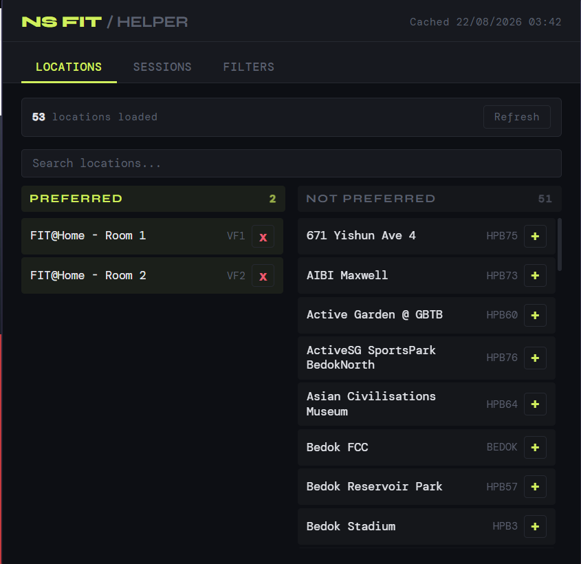
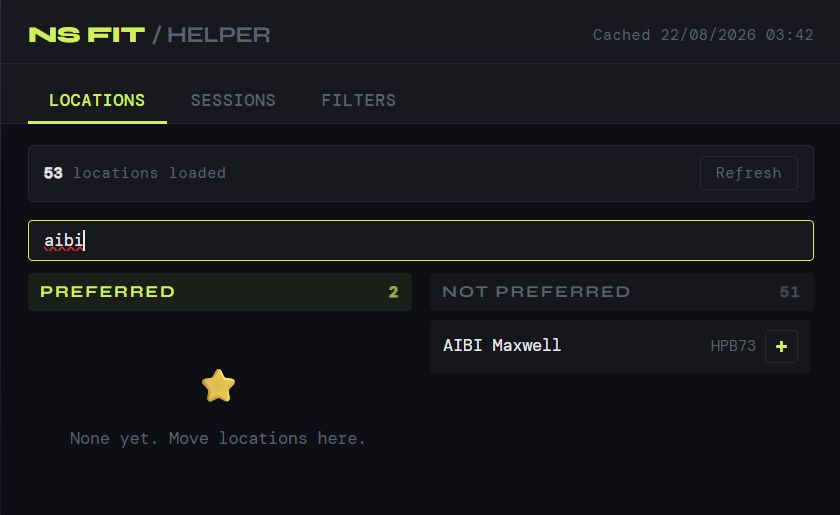
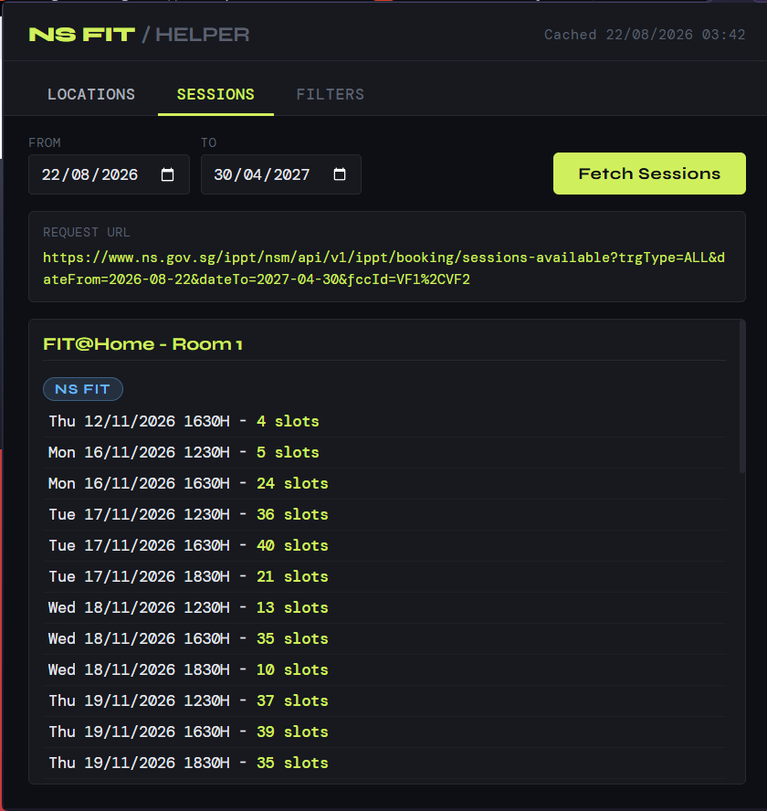
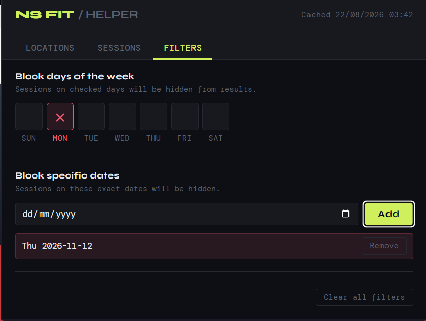
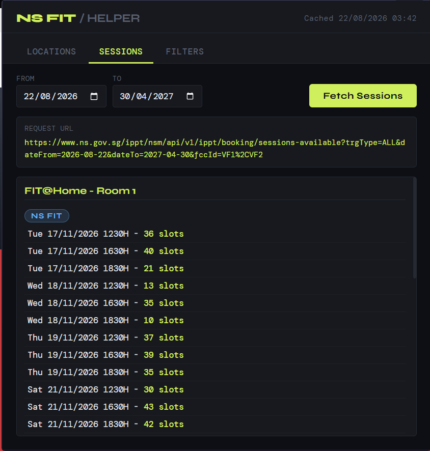

# NS FIT and IPPT Helper

A Chromium browser extension that makes planning NS FIT and IPPT sessions easier.

## Features

- Browse NS FIT and IPPT locations.
- Search locations and mark preferred locations.
- Fetch available sessions for a selected date range.
- Hide sessions on selected days of the week.
- Hide sessions on specific dates.
- Saves preferred locations, dates, and filters locally in the browser automatically.

## Screenshots

### 1. Browse locations



### 2. Search and choose preferred locations



### 3. View available sessions



### 4. Configure filters



### 5. View filtered sessions



## Installation

1. Download the latest `ns-fit-helper.zip` file from the [GitHub Releases](../../releases) page.
2. Unzip the downloaded file to a folder on your computer.
3. Open your browser's extensions page:
   - Chrome: `chrome://extensions`
   - Microsoft Edge: `edge://extensions`
4. Enable **Developer mode**.
5. Click **Load unpacked**.
6. Select the unzipped extension folder.
7. Open the extension and sign in to [ns.gov.sg](https://www.ns.gov.sg/) with Singpass before fetching locations or sessions.

Do not select the ZIP file directly. The ZIP must be extracted first, and you should select the folder containing `manifest.json`.

## Usage

1. Open the extension from your browser toolbar.
2. In **Locations**, refresh the location list if needed and mark locations as preferred.
3. Open **Sessions**, choose a date range, and select **Fetch Sessions**.
4. Use **Filters** to hide sessions on specific weekdays or dates.

The extension only displays session availability returned by `ns.gov.sg`. It does not book sessions automatically.

## Permissions

- `storage`: Saves extension settings locally, including preferred locations, dates, and filters.
- `tabs`: Opens the ns.gov.sg login page when required.
- Access to `https://www.ns.gov.sg/*`: Retrieves location and session information from ns.gov.sg.

## Development

The extension itself runs without `node_modules`. The development dependencies are only for IntelliSense.

The project uses pnpm:

```bash
pnpm install
```

Load the project folder through **Load unpacked** while developing. After changing extension files, reload the extension from the browser's extensions page.

## Project Structure

- `manifest.json` - Extension metadata and permissions
- `background.js` - Background service worker and ns.gov.sg requests
- `popup.html` - Extension popup structure
- `popup.js` - Popup behavior and settings
- `popup.css` - Popup styling
- `session-results.js` - Session result rendering
